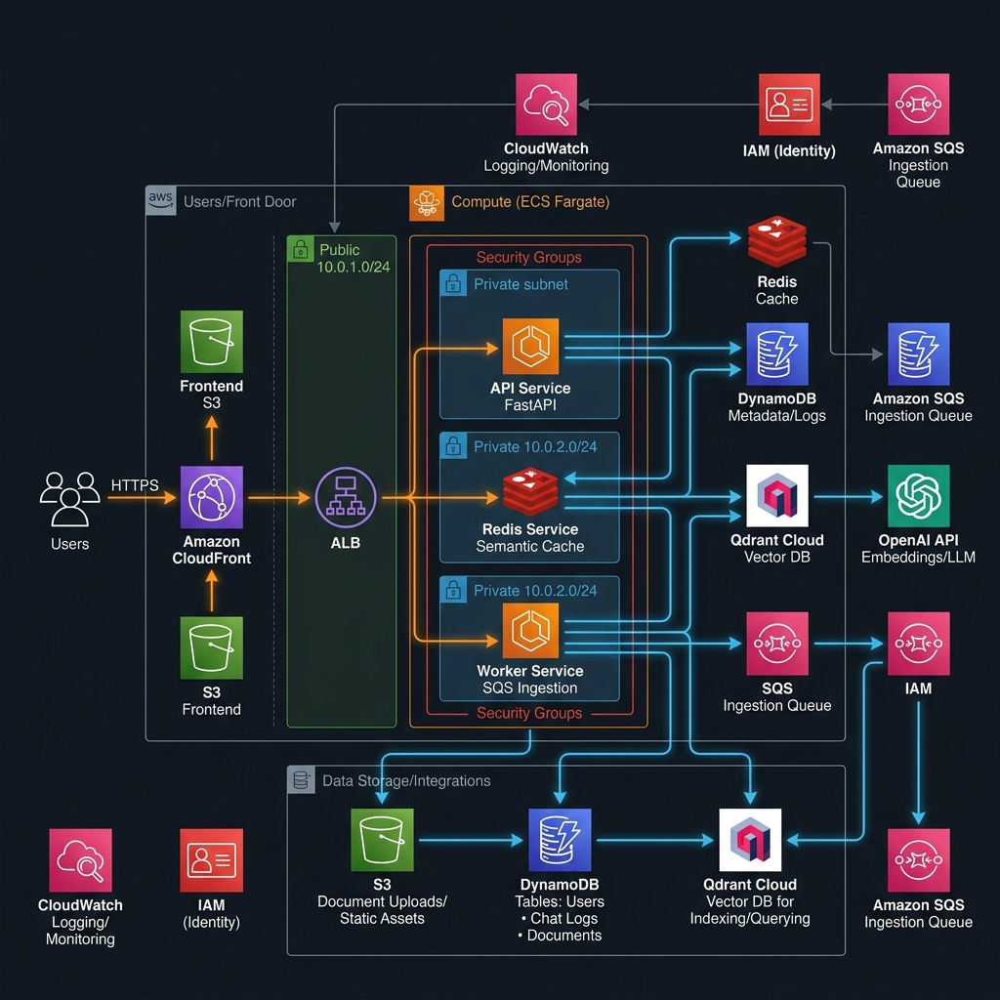
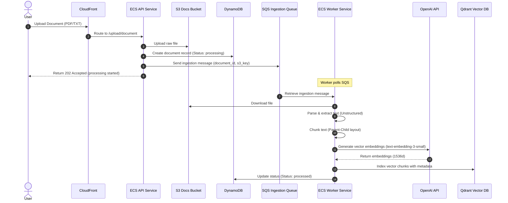
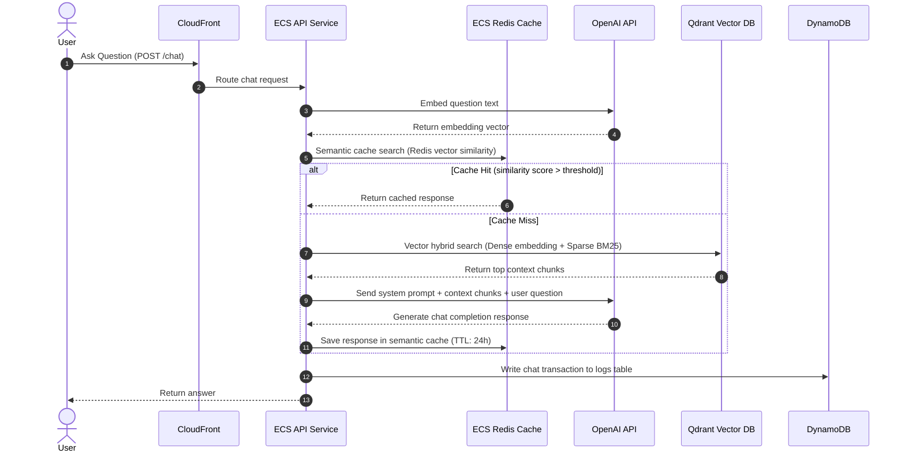

# Enterprise RAG System Design & Architecture

This document describes the system architecture and deployment design for the Enterprise Retrieval-Augmented Generation (RAG) platform, as implemented and deployed in AWS.

---

## 1. High-Level Architecture Diagram

Below is the visual topology of the AWS deployment, showing the ingress path, compute tasks in Amazon ECS, data storage in S3 and DynamoDB, and integrations with Qdrant Cloud and OpenAI.

---

## 2. Core Architecture Components

The platform is designed around a decoupled, asynchronous, and cost-optimized architecture consisting of the following key tiers:

### A. Ingress & Presentation Layer
*   **Amazon CloudFront**: Acts as the global content delivery network (CDN) and the primary entry point. It serves the static React frontend from an S3 bucket over HTTPS, and forwards API calls (routes starting with `/api/`, `/auth/`, `/health/`, `/documents/`, `/upload/`, `/chat/`) to the backend Application Load Balancer.
*   **Amazon S3 (Frontend)**: Stores the built production assets (HTML, CSS, JS) of the React/Vite web application. It is configured for static website hosting and is locked down so that it only permits access via CloudFront.
*   **Application Load Balancer (ALB)**: Receives API requests routed by CloudFront and distributes them across the active containers in the Amazon ECS Fargate cluster.

### B. Compute Layer (Amazon ECS Fargate)
The compute tier runs in an Amazon ECS cluster (`enterprise-rag-cluster`) powered by AWS Fargate (serverless container execution) inside public subnets:
1.  **API Service (`api`)**:
    *   **Technology**: FastAPI running on Python.
    *   **Port**: 8000.
    *   **Sizing**: 1024 CPU / 2048 MB.
    *   **Role**: Handles user management, authentication, document upload registration, database queries, semantic caching, and chat/RAG operations.
2.  **Worker Service (`worker`)**:
    *   **Technology**: SQS consumer service.
    *   **Sizing**: 512 CPU / 1024 MB.
    *   **Role**: Runs an asynchronous polling loop consuming tasks from Amazon SQS, handling heavy CPU/memory-bound tasks like document downloading, text extraction, semantic chunking, embedding generation, and indexing in Qdrant.
3.  **Redis Service (`redis`)**:
    *   **Technology**: Redis Stack.
    *   **Port**: 6379.
    *   **Sizing**: 512 CPU / 1024 MB.
    *   **Role**: Internal container serving as a semantic cache for chat requests to minimize OpenAI cost and speed up response times. (Service discovery coordinates its DNS at `redis.local`).

### C. Database & Data Storage Tier
*   **Amazon DynamoDB**: Key-value and document store used for operational state:
    *   `enterprise-rag-users`: Stores user profiles and credentials.
    *   `enterprise-rag-documents`: Stores document processing statuses, metadata, and chunk references.
    *   `enterprise-rag-chat-logs`: Tracks conversational history and RAG interactions.
*   **Amazon S3 (Documents)**: Secure bucket (`enterprise-rag-documents-testing`) storing raw uploaded documents (PDFs, TXT, DOCX) processed by the ingest system.
*   **Qdrant Cloud**: A managed vector database hosting the vector indices (`enterprise_rag` collection) for hybrid lexical/dense search.
*   **Amazon SQS (Simple Queue Service)**:
    *   `enterprise-rag-ingestion-queue`: Coordinates async work between the API and the Ingestion Worker.
    *   `enterprise-rag-ingestion-dlq`: Dead Letter Queue to capture poison messages or ingestion failures.

### D. Identity & Security
*   **AWS Systems Manager (SSM) Parameter Store**: Stores sensitive environment variables (OpenAI API key, Qdrant API key, Admin Password, JWT Secret) securely. ECS injects these as env vars into tasks at startup.
*   **AWS IAM Roles**: Scoped execution role (`enterprise-rag-ecs-execution-role`) and task role (`enterprise-rag-ecs-task-role`) granting container permissions to pull from Docker Hub, write logs to CloudWatch, access parameters in SSM, and read/write to S3, DynamoDB, and SQS.
*   **Amazon Cognito**: Provisioned User Pool and Client for identity federation (ready for future direct API integration).

---

## 3. System Data Flows

### A. Document Ingestion Pipeline (Asynchronous)

### B. Chat & Query Pipeline (RAG with Cache)

---

## 4. Network Topology & Cost Optimization

To keep the operational cost of the test deployment extremely low (~$2.50–$4/day), the network topology avoids several expensive AWS enterprise configurations while retaining high security:

1.  **Zero NAT Gateways**: Running NAT Gateways costs ~$1.10/day per gateway. Instead, both ECS API and Worker tasks run in **Public Subnets** and are assigned public IPs. They pull images and communicate with external services (OpenAI, Qdrant Cloud) directly through the Internet Gateway.
2.  **Strict Security Group Filters**:
    *   **ALB Security Group**: Open to the public internet on port 80 (HTTP) to receive requests forwarded by CloudFront.
    *   **ECS Tasks Security Group**:
        *   Accepts inbound TCP traffic on port `8000` (API) **only** if the request originates from the ALB Security Group.
        *   Accepts internal traffic from its own group members on all ports to enable cluster-internal communication (API container talking to `redis.local` on `6379`).
        *   Allows unrestricted egress (`0.0.0.0/0`) for API integrations (OpenAI, Qdrant, AWS S3/DDB APIs).
3.  **VPC Sizing**: Configured with CIDR block `10.0.0.0/16` split across two public subnets in different Availability Zones (e.g., `10.0.1.0/24` in `ap-south-1a`, `10.0.2.0/24` in `ap-south-1b`) for target group distribution.

---

## 5. Security & Hardening Measures

*   **SSM Environment Injection**: No secrets are stored in code or task definition JSONs. Environment variables like `OPENAI_API_KEY`, `QDRANT_API_KEY`, `JWT_SECRET`, and `ADMIN_PASSWORD` are fetched as `SecureString` types from SSM Parameter Store during container spin-up.
*   **Transit Security**: Frontend requests travel over HTTPS terminated at CloudFront.
*   **Database Isolation**: DynamoDB tables and S3 buckets do not have public endpoints enabled; all access is authorized via IAM policies scoped to the ECS Task Role (`enterprise-rag-ecs-task-role`).
*   **Password Security**: Production logins use strong password verification (minimum 12 characters, non-common patterns) and hash verification using PBKDF2 with SHA-256 (600,000 iterations).

---

## 6. Enterprise Scaling & Production Recommendations

To transition this deployment from a test deployment to a resilient, production-grade system, the following architectural upgrades are recommended:

1.  **Private Subnets & NAT Gateways**: Move the ECS containers (API, Worker, Redis) into private subnets. Use NAT Gateways (or VPC endpoints for S3, SQS, DynamoDB, SSM) to allow egress while blocking all direct ingress.
2.  **Dedicated Redis and Vector Stores**: Replace the ephemeral single-node ECS Redis container with **Amazon ElastiCache for Redis** (multi-AZ) for reliable caching.
3.  **HTTPS for Ingress API**: Bind an AWS Certificate Manager (ACM) SSL certificate to the ALB and configure CloudFront to talk to the ALB over HTTPS (port 443).
4.  **Auto-Scaling**: Configure ECS Auto-Scaling policies based on CPU and memory thresholds for the API task, and SQS Queue backlog length (backlog per task) for the Ingestion Worker.
